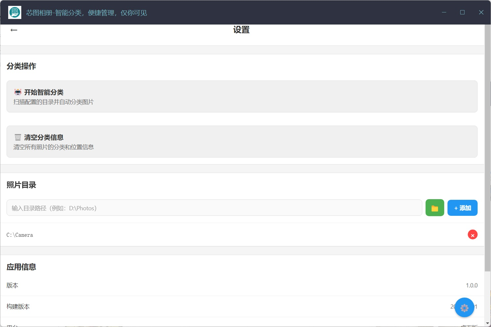
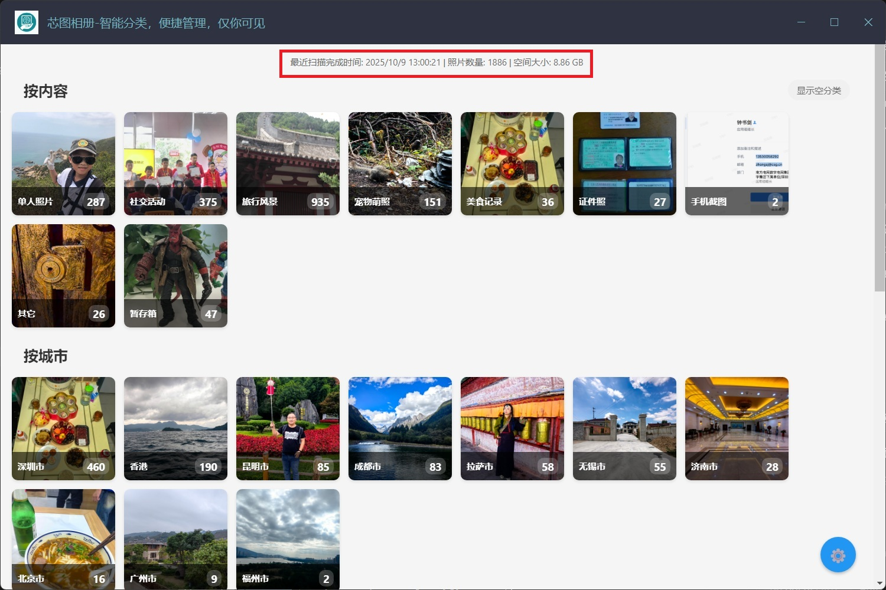
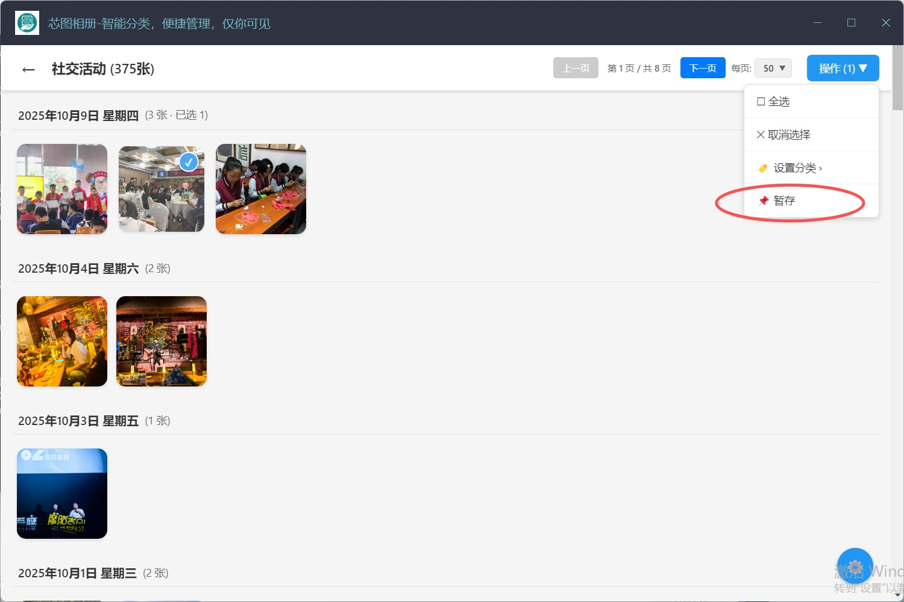

# 💭 您是否也曾经历过这样的时刻？

在旅途中，我们举起镜头，想要留住山河壮阔的壮丽瞬间；在聚会时，我们按下快门，渴望定格与好友欢聚的每一张笑脸；回到家中，我们随手一拍，记录下家人的温情陪伴与宠物的暖心依赖；甚至当美食上桌，我们也习惯性地“咔嚓”一声，将色香味俱全的体验封存为永恒的记忆……

科技让拍照变得轻而易举，却也带来了“幸福的烦恼”。为了捕捉最完美的瞬间，我们常常对同一场景连拍数张；工作之中，相机也成为得力助手——会议实录、资料拍摄、事实留存、沟通截图……大量的图片无声地堆积在手机相册中，其中有珍贵的文档、美好的回忆，也有重要的凭证。

日积月累，手机存储空间频频告急，而云备份又让人担忧隐私安全。如何高效整理海量照片，在释放空间的同时，守护每一份珍贵记忆，已成为我们每个人都需要面对的日常课题。

**芯图相册，正是为您解决这一难题而生的智能伙伴。**

我们运用最新AI技术，在您的设备本地即可对照片进行智能识别与分类。无需登录、无需网络、更无任何内嵌广告——从根源上杜绝隐私泄露风险，给您纯粹、安心的整理体验。

# 📁 核心功能：智能分类，便捷管理

· 第一版已支持按内容、城市、相似度三大维度进行分类
· 内容识别覆盖七大常见类别：手机截图、证件照片、单人照、社会活动（多人照）、自然风景、美食与萌宠
· 经过严格测试，分类准确率稳定在90%以上
· 如有个别分类有误，您也可手动调整，灵活又贴心

# 📋 操作指引：四步完成相册焕新

以手机相册清理为例，轻松上手：

1. 🔗 连接与设置
       使用数据线连接手机与电脑，在设置页面选定需要整理的相册目录。

  
  

2. 🤖 一键智能分类
       点击"开始智能分类"，AI将自动扫描识别，首页清晰展示分类进度与图片统计。

  

3. ✅ 便捷拣选暂存
       分类完成后，可逐类浏览，轻松勾选需要处理的作品，一键移入暂存箱。

  

4. 🗑️ 最终清理或归档
       进入暂存箱二次确认，无误后全选删除，或复制到指定文件夹完成归档。

  
  

